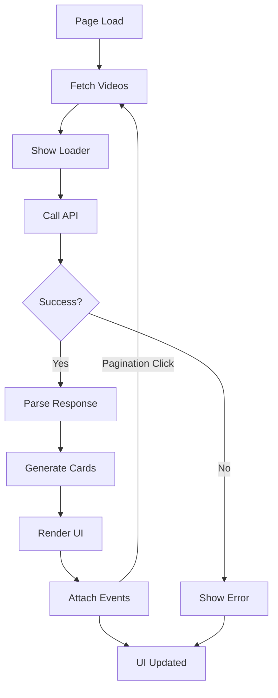

# YouTube Videos Listing UI

This project is a simple, clean, and responsive web application that fetches and displays a list of YouTube videos from a public API. It features a modern UI built with Tailwind CSS, includes a loading state, and provides pagination to browse through the video collection.

## Live Demo

[Insert your live demo link here](https://example.com)

## Features

- **Dynamic Video Fetching:** Asynchronously fetches video data from the FreeAPI.
- **Responsive Grid Layout:** Displays videos in a responsive grid that adapts to different screen sizes.
- **Video Card UI:** Each video is presented as a card with a thumbnail, title, channel name, view count, and upload time.
- **Pagination:** Simple "Previous" and "Next" buttons to navigate through pages of videos.
- **Loading State:** Shows a loading spinner while fetching data.
- **Error Handling:** Displays a user-friendly message if the API fails to load data.
- **Modular JavaScript:** Code is organized into modules for better readability and maintenance.

## Technologies Used

- **HTML5:** For the basic structure of the web page.
- **Tailwind CSS:** For all styling, used via the Tailwind CDN for rapid UI development.
- **Vanilla JavaScript (ES6+ Modules):** For all the dynamic logic, including API calls and DOM manipulation.
- **FreeAPI:** The public API endpoint used to get YouTube video data.

## Project Structure

The project is organized into the following files and directories:

```
.
├── index.html          # The main HTML file
├── scripts.js          # Main JavaScript file for API logic and rendering
└── utils/
    └── videoFormat.js  # Utility functions for formatting data (views, duration, etc.)
```

## How It Works (Process Flow)

The application follows a simple data flow:

1.  **Initial Load:** The `index.html` file is loaded, which includes the Tailwind CSS CDN and the main `scripts.js` file as a module.
2.  **Fetch Data:** The `fetchVideos()` function in `scripts.js` is called. It displays a loading spinner.
3.  **API Call:** An asynchronous `fetch` request is made to the FreeAPI endpoint to get a paginated list of videos.
4.  **Process Response:** The JSON response is parsed. The video data is extracted.
5.  **Render Videos:** The video data array is mapped to create an HTML string for each video card. Utility functions from `videoFormat.js` are used to format views, duration, and time since publication.
6.  **Update DOM:** The generated HTML for the video grid and pagination controls is injected into the main application container (`<div id="app">`).
7.  **Add Event Listeners:** Event listeners are attached to the "Previous" and "Next" buttons to call `fetchVideos()` again with the new page number.

### Process Diagram

Here is a graphical representation of the process:



## Getting Started

To run this project locally, you don't need any complex setup. Just follow these steps:

1.  **Clone the repository:**
    ```bash
    git clone <your-repository-url>
    ```
2.  **Navigate to the project directory:**
    ```bash
    cd <project-directory>
    ```
3.  **Open `index.html` in your browser:**
    You can simply double-click the `index.html` file, or use a simple local server. If you have VS Code with the "Live Server" extension, you can right-click `index.html` and select "Open with Live Server".

## Code Explanation

### `index.html`

-   This is the entry point of the application.
-   It links to the **Tailwind CSS CDN** and a Google Font (`DM Sans`).
-   The `<body>` contains a `<header>` and a `<main>` section with a single `<div id="app">`. This div is where all dynamic content (loading spinner, video grid, error messages) will be rendered by JavaScript.
-   `scripts.js` is included at the end of the body with `type="module"` to enable ES6 module imports/exports.

### `scripts.js`

-   **`BASE_URI`**: The constant for the API endpoint.
-   **`fetchVideos(page)`**: This is the core asynchronous function.
    -   It first updates the DOM to show a loading indicator.
    -   It fetches data from the API using the provided `page` number.
    -   It performs error handling and updates `totalPages` and `currentPage` variables.
    -   It calls `map()` on the `videos` array to transform the raw data into HTML for the video cards.
    -   It updates the DOM with the final grid and pagination buttons.
    -   It attaches click event listeners to the pagination buttons.
-   The script finishes by calling `fetchVideos(1)` to load the initial data.

### `utils/videoFormat.js`

This file contains pure helper functions that are exported for use in `scripts.js`. This separation of concerns makes the code cleaner.

-   **`formatViews(n)`**: Takes a number and returns it as a formatted string (e.g., `1.2M views`, `5.6K views`).
-   **`formatDuration(iso)`**: Converts an ISO 8601 duration string (e.g., `PT1M35S`) into a user-friendly `MM:SS` format.
-   **`timeAgo(dateStr)`**: Calculates the time difference between now and the provided date string and returns a relative time (e.g., `5 days ago`).

## API Endpoint

The application uses the following public API to fetch YouTube video data:

-   **URL:** `https://api.freeapi.app/api/v1/public/youtube/videos`
-   **Method:** `GET`
-   **Query Parameters:**
    -   `page`: The page number to fetch (e.g., `1`, `2`).
    -   `limit`: The number of videos per page (hardcoded to `12` in this project).

## Contributing

Contributions are welcome! If you have suggestions for improvements or find any bugs, please feel free to open an issue or submit a pull request.

1.  **Fork the repository.**
2.  **Create a new branch:** `git checkout -b feature/YourFeatureName`
3.  **Make your changes.**
4.  **Commit your changes:** `git commit -m 'Add some feature'`
5.  **Push to the branch:** `git push origin feature/YourFeatureName`
6.  **Open a Pull Request.**

## License

This project is licensed under the MIT License. See the [LICENSE](LICENSE) file for details.
